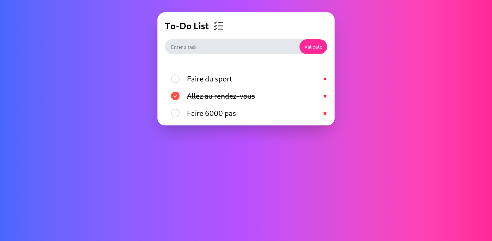

# 📝 To-Do List Web App

Une application web simple et élégante de liste de tâches, développée avec **HTML**, **TailwindCSS** et **JavaScript**. Elle permet à l'utilisateur d'ajouter, de cocher et de supprimer des tâches avec persistance locale via **localStorage**.

---

## 🚀 Démo

---

## 📦 Fonctionnalités

- ✅ Ajouter une nouvelle tâche
- ❌ Supprimer une tâche
- ✔️ Marquer une tâche comme terminée
- 💾 Sauvegarde automatique des tâches dans le navigateur (`localStorage`)
- 🎨 Interface responsive et moderne grâce à TailwindCSS

---

## 🧰 Technologies utilisées

- **HTML5**
- **TailwindCSS**
- **JavaScript Vanilla**
- **LocalStorage API**

---

## 📂 Structure du projet

to-do-list/
├── index.html # Page principale
├── index.js # Script principal
├── output.css # Fichier CSS généré par Tailwind
├── unchecked.png # Icône tâche non cochée
├── checked.png # Icône tâche cochée
├── task-svgrepo-com.svg # Icône en-tête
└── README.md # Fichier de documentation

